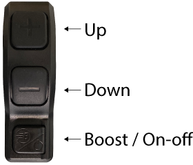

# The Unofficial Luna X-1 Enduro Display Manual

The X-1 comes equipped with Bafang's M600 drive system. This includes the G521 motor and DP C240 display & controller.

## The Controller
You'll use the buttons on the controller to navigate the display, change settings, and adjust the configuration.

## Display Basics
The display shows information about your e-bike's settings and riding statistics.

### Battery Remaining
Displays the remaining capacity of the battery as a percentage value.

### Headlight/Backlight Indicator
Press and hold the **Up** button to toggle the display backlight. The display also features a light sensor that will automatically trigger the display backlight and headlight (if equipped) when in a dark environment. The headlight icon will appear when the headlight/backlight is active.

### Assist Setting
Press **Up** to increase the assist level and **Down** to decrease. Assist levels start at 0 (no assistance) and scale up to 5 (maximum assistance).

* Boost Mode
* 5 (maximum assistance)
* 4
* 3
* 2
* 1 (minimum assistance)
* 0 (no assistance)
* Walking Mode

#### Boost Mode
Boost mode is a feature for bikes configured with a low speed limit and no throttle. This feature allows the rider to get full motor power temporarily, even while at the limit. Since the X-1 limiter is configured to 56 MPH, this feature is not used.

#### Walking Mode
Repeatedly press **Down** until the walking mode icon is displayed. Then press and hold **Down** for 2 seconds and the motor will move the bike along at a walking pace. To stop, release the **Down** button.

*Note: You **do not** need to use the throttle while using Walking Mode. Doing so may cause the bike to leap out of your grip.*

### Info Display
Cycle the info line by briefly pressing the **Boost / ON-OFF** button. Available information includes:

* **TRIP** (km,mi) - trip distance traveled (can be reset in settings)
* **ODO** (km,mi) - total distance traveled
* **MAX** (km/h,mph) - maximum speed (reset by trip reset)
* **AVG** (km/h,mph) - average speed (reset by trip reset)
* **RANGE** (km,mi) - estimated range remaining
* **CAL** (Kcal) - the rider's energy consumption (reset when the bike is turned off)
* **POWER** (W,A) - real-time power output
* **TIME** (minutes) - riding time (reset by trip reset)

## Adjusting Settings
To enter the settings menu, press and hold the **Up** and **Down** buttons at the same time for 3 seconds. The display will show the main settings menu. Use the **Up** and **Down** buttons to select an item, and press the **Boost / ON-OFF** button to activate an item.

The menu is arranged in a two-tier heirarchy, with the following items:

* Setting
	* Unit
	* Auto Off
	* Brightness
	* Power View
	* Al Sensitivity
	* Trip Reset
	* Vibration
	* Service
	* Assist Mode
	* Back
* Information
	* Wheel Size
	* Speed Limit
	* Display Info
	* Controller Info
	* Torque Info
	* Error Code
	* Back
* Exit

Details for each menu item follow:

### Setting
These settings can be configured to adjust the operation of your bike.

#### Unit
Configures the linear unit of measure used for speed, trip, odometer, etc.
	
* Imperial: miles
* Metric: kilometers

#### Auto Off
Configures the time (in minutes) before the system automatically turns off. Can be disabled by selecting **OFF** from the menu. Note that the system draws a small amount of power, even when the bike is not moving. It will slowly deplete your battery if auto off is disabled and the bike is left on.

* OFF, 0–9

#### Brightness
The brightness of the display as a percentage of maximum intensity.

* 10%, 30%, 50%, 75%, 100%

#### Power View
Configures the unit used to display the real time power output.

* Current: amps
* Power: watts

#### Al Sensitivity
Configures the sensitivity of the light sensor for the backlight / headlight. Note that this is a capital "a" followed by a lower case "l", which stands for **A**uto-**L**ight. The font makes it easily confused with **A**rtificial **I**ntelligence. Other display firmware versions use all-caps "AL".

* 0–5
* 0 disables the auto-light
* 1 is the lowest sensitivity
* 5 is the highest sensitivity

#### Trip Reset
Resets the trip values. See *Info Display* section for a list of values reset by this function.

* YES, NO

#### Vibration
Enables a vibration with each press of a controller button.

* YES, NO

#### Service
Enables service mode.

* YES, NO

#### Assist Mode
Configures the available number of assistance levels. Note that changing this does not change the amount of total assistance available. It is best to think of them as divisions of a whole. E.g. 1/3, 2/3, 3/3 for 3 levels of assist and 1/5, 2/5, 3/5, 4/5, 5/5 for 5 levels of assist.

* 3, 5, 9

#### Back
Navigates back to the main menu.

### Information
These settings are for information only. They are loaded with the firmware and cannot be changed.

#### Wheel Size
28 Inch, the size of the wheel used for computing speed.

#### Speed Limit
90 km/h / 56 MPH, limits the top speed of the bike.

#### Display Info
Displays the hardware and software version of the display.

#### Controller Info
Displays the hardware and software version of the controller.

#### Torque Info
Displays the hardware and software version of the torque sensing unit.

#### Error Code
Displays a list of the 10 most recent error codes. 

#### Back
Navigates back to the main menu.

### Exit
Exits the menu system.
